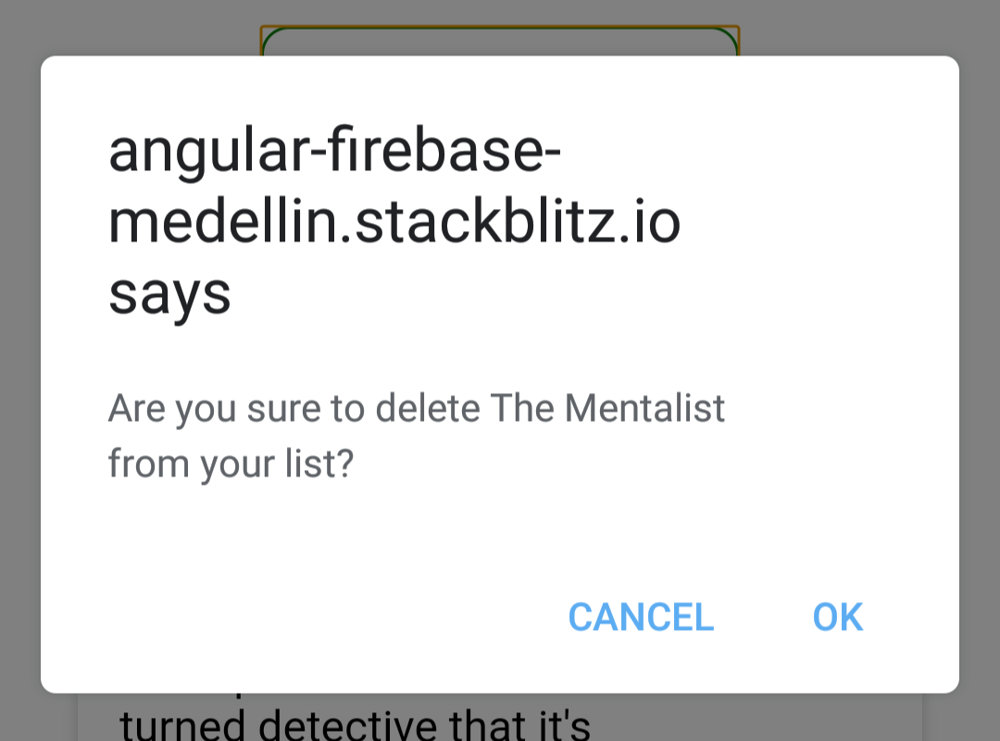

# Removing objects from our database

In this lesson we'll finish building our application, the only missing functionality is the ability to remove content from the database.

Fortunately, we've already done all the leg work for this, including calling the delete function from the `CardComponent` HTML, now, we just need to take care of the details.

First, open `card.component.ts` and create a `deleteShow()` function, it should take the show's ID and name as parameters.

```js
deleteShow(showId: string, showName: string): void {}
```

Since deleting data from the database is a **destructive** operation we want to add some validation before to make sure your users don't remove TV shows just because they clicked the wrong button. Go ahead and add a generic JavaScript `confirm alert`.

It should prompt the user for confirmation before calling the delete function:

```js
deleteShow(showId: string, showName: string): void {
  if(confirm(`Are you sure to delete ${showName} from your list?`)){
    // Call the delete function!
  }
}
```



Now that the user is sure that's the show they want to remove, let's add the remove functionality:

```js
deleteShow(showId: string, showName: string): void {
  if(confirm(`Are you sure to delete ${showName} from your list?`)){
    this.firebaseService.deleteShow(showId);
  }
}
```

We're calling the `.deleteShow(showId)` function from our Firebase service, and since that function doesn't exist, it's time to go to `firebase.service.ts` to create it.

```js
public deleteShow(showId: string): Promise<void> {
  return this.tvShowCollection.doc(showId).delete();
}
```

The function takes the `showId`as a parameter and then it goes to that document and calls firestore's `delete()` function, this function removes the entire document from the database.
